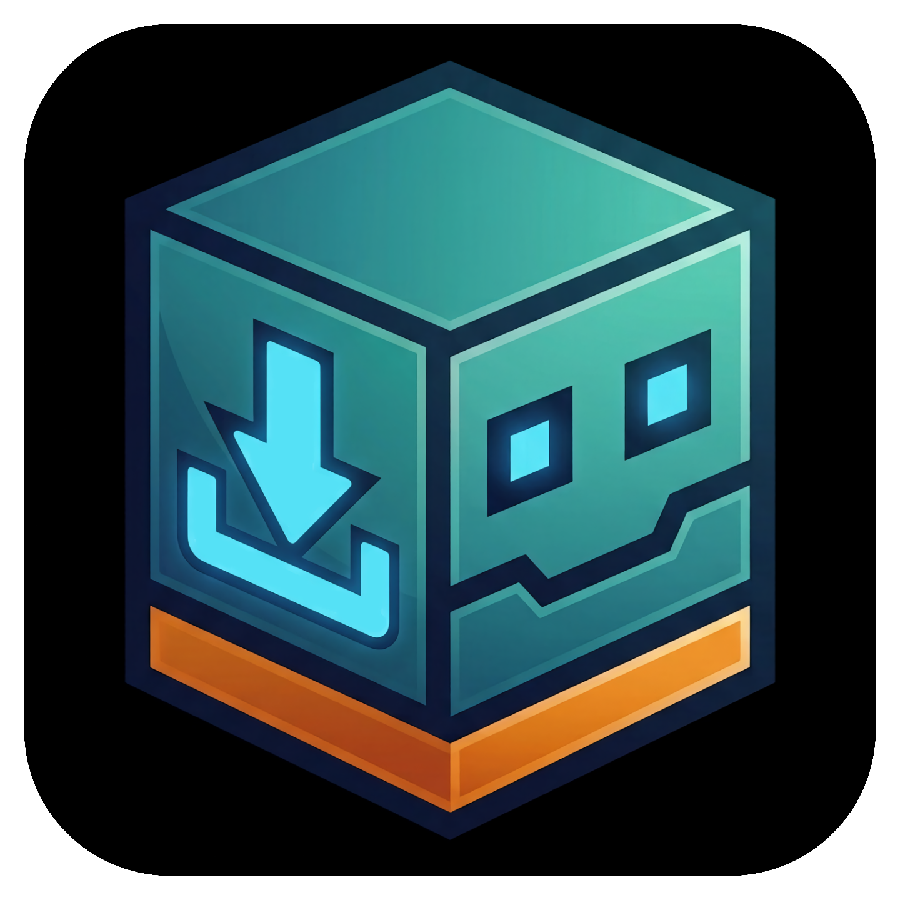

  

<h1 align="center">Macrodl</h1>

  <b>Download Geometry Dash macros from Hyperbolus without ever leaving the game.</b> 
  One tap on the level page. Filtered, saved and organized for you.

  
  
  
  

---

## Overview

Getting a macro for a level used to be a chore: leave the game, open Hyperbolus in a browser, find the level, download the file, move it into the right folder, and finally return to Geometry Dash.

Macrodl removes every one of those steps. It adds a button to the level page that finds the macros for that level on [Hyperbolus](https://hyperbolus.net), downloads the one you want and saves it straight into the folder your macro bot reads from.

## How to use

1. Open any online level page.
2. Tap the blue download button in the left-side menu.
3. Macrodl finds the macros submitted for that level, applies your format filter and saves the file to your macro folder.

If more than one macro matches your filter, a list opens so you can choose which one to download.

The green folder button opens your library of downloaded macros, where you can delete individual macros or all of them, and jump to the settings.

## Settings

- **Format filter**: GDR + GDR2, GDR only, GDR2 only, or all formats.
- **Always choose manually**: show the list even when only one macro matches.
- **Save folder**: pick the folder where to save downloaded macros. Leave it empty for the default folder.
- **File naming**: keep the original name, or prefix it with the level name or level ID.
- **If the file already exists**: rename, overwrite or skip.

## Credits and disclaimer

Macros are created and uploaded by the Hyperbolus community and remain the property of their authors. Macrodl is an independent project and is not affiliated with or endorsed by Hyperbolus. If you find the site useful, consider supporting [Hyperbolus](https://hyperbolus.net).

Built on [Geode](https://geode-sdk.org).

Made by <a href="https://github.com/novalattasya"><b>novalattasya</b></a>

